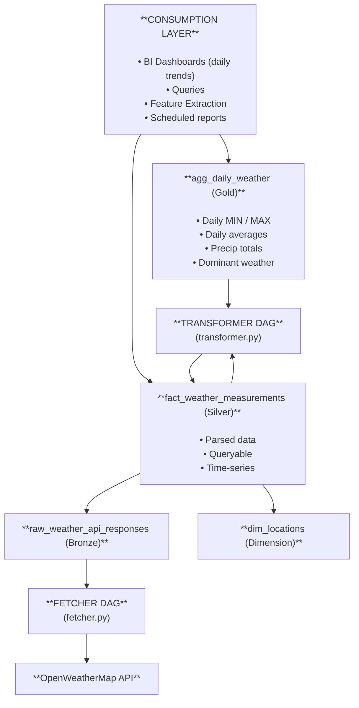

# Stryker Take-Home Project — Senior Data Engineer

**Version 3.0 | Updated: 2026-01**

Welcome to the Stryker Senior Data Engineer take-home exercise. This repository provides a lightweight, opinionated starting point intended to simulate a realistic data engineering workload at Stryker.

This challenge is **not** about completing a large volume of code. Instead, it is designed to surface how you think about data systems, tradeoffs, modeling decisions, scalability, and long-term maintainability.

---

## Problem Overview

A common responsibility for Senior Data Engineers at Stryker is designing and maintaining robust pipelines that ingest third-party data, model it appropriately, store it efficiently, and make it available for downstream consumers such as analytics, reporting, and data science teams.

This exercise represents a simplified snapshot of that responsibility.

To reduce setup overhead, we provide scaffolding for the execution environment (Docker, Airflow, and Postgres). You are encouraged to use, modify, or replace these components if you believe an alternative approach is more appropriate—provided you clearly document your rationale.

---

## What You’ll Build

For this project, you will ingest **current weather data** from the  
[OpenWeatherMap Current Weather API](https://openweathermap.org/current).  
The free API tier is sufficient; **no paid subscription is required**.

At a high level, the system consists of:

### Core Components (Provided)

- **Airflow**  
  Used to orchestrate ingestion and transformation workflows.

- **Postgres**  
  Used as the analytical storage layer for both raw and derived datasets.  
  (You may substitute another database if you prefer.)

- **Docker / Docker Compose**  
  Used to provide a reproducible local execution environment.

---

## Data Flow Expectations

The expected flow is intentionally flexible but should generally include the following stages:

1. **Ingestion (Fetcher DAG)**

   - `fetcher.py` retrieves data from the OpenWeatherMap API.
   - Data should be validated, normalized, and cleaned as appropriate.
   - Raw or lightly processed data should be persisted to Postgres.
   - Design with **schema evolution**, **data quality**, and **idempotency** in mind.

2. **Transformation (Transformer DAG)**

   - `transformer.py` produces one or more derived datasets.
   - Transformations may be implemented in **Python**, **SQL**, or a hybrid approach.
   - Derived tables should support historical analysis and downstream analytics use cases.

3. **Consumption**
   - Assume downstream users will query both raw and transformed datasets.
   - Queries may include time-series analysis, aggregations, or feature extraction.

---

## Design Philosophy

This exercise is intentionally open-ended.

We are far more interested in:

- **How you structure the problem**
- **Why you make certain design choices**
- **How you balance simplicity vs. scalability**
- **How you communicate assumptions and tradeoffs**

Perfection is not expected. Thoughtfulness is.

> **Note:**  
> If you are uncomfortable with Docker, Airflow, or Postgres, you may replace them with alternatives (e.g., local Python execution, SQLite, dbt, etc.). Just document your decision clearly—we will ask about it during follow-up discussions.

---

## Deliverables

Please submit a GitHub pull request containing:

- Source code for:
  - Data ingestion (fetcher)
  - Data transformation logic
- SQL (or equivalent) defining your data model
- Updates to `README.md` that include:
  - Design notes
  - Assumptions
  - Tradeoffs
  - Potential next steps

---

## Evaluation Criteria

We will evaluate this submission as part of a **Senior Data Engineer** interview loop. Review will focus on:

- **Code quality**
  - Readability, structure, naming, and maintainability
- **Data modeling**
  - Schema design, normalization vs. denormalization, relationships
- **Data engineering fundamentals**
  - Idempotency, error handling, observability, performance considerations
- **Technical judgment**
  - Tooling choices and architectural tradeoffs
- **Communication**
  - Clarity of documentation and reasoning

---

## Time Expectations

We recognize that senior candidates have limited availability.

- Expected effort: **~2 hours**
- Spending more or less time is entirely your choice.
- Please note your actual time spent in the section below so we can evaluate your work fairly and in context.

If you choose to go beyond the basics (e.g., testing, schema evolution, incremental loads), that’s welcome—but not required.

---

## Use of Public Resources

We encourage you to attempt this challenge independently.

That said, real-world engineering often involves referencing documentation, blog posts, or existing solutions. If you build upon external work, please:

- Clearly note it in your comments or README
- Provide links to the original sources
- Explain what you adapted or changed

Transparency matters more than originality.

---

## Getting Started

### Environment Setup

1. Fork and clone this repository.
2. Ensure Docker Desktop is installed and running.
3. Initialize and start the environment:

```bash
# Initialize folders and Airflow user
mkdir -p ./logs ./plugins
echo -e "AIRFLOW_UID=$(id -u)" > .env

# Initialize Airflow metadata DB
docker-compose up airflow-init

# Start services
docker-compose up
```

- Airflow UI: [http://localhost:8080](http://localhost:8080)
- Username / Password: `airflow / airflow`

If you encounter issues, refer to the official Airflow Docker docs:
[https://airflow.apache.org/docs/apache-airflow/stable/start/docker.html](https://airflow.apache.org/docs/apache-airflow/stable/start/docker.html)

---

### Implementation Notes

- There are several `TODO` markers in the repository—feel free to go beyond them.
- DAG examples are adapted from the official Airflow tutorial.
- For database interactions, you may reference:

  - Airflow Postgres Operator documentation
  - Native Python DB libraries
  - Any abstraction you deem appropriate

For simplicity, you may store all datasets in the Airflow-managed Postgres instance.

---

### Apple Silicon Note

If you are using Apple hardware (M1/M2), Docker image compatibility may require additional configuration.
Reference:
[https://javascript.plainenglish.io/which-docker-images-can-you-use-on-the-mac-m1-daba6bbc2dc5](https://javascript.plainenglish.io/which-docker-images-can-you-use-on-the-mac-m1-daba6bbc2dc5)

---

## Your Notes (README.md)

Use the sections below to document your work.

### Time Spent

**Approximate total time spent on the exercise.**  
Include any learning or research time if applicable.

I spent approximately **3 hours** on initial research and designing the solution.

After establishing the design, I reviewed GitHub repositories with similar implementations to understand best practices for operators and modular structure. I found [this repository](https://github.com/fahmizainal17/OpenWeatherMap_Data_Pipeline_Engineering_Project) particularly helpful due to its clear separation between business logic and DAG definitions. Besides, I've been learning about medallion architecture and I thought it would be a good approach for this case so I decided to learn more about it. I took this [article](https://medium.com/@junshan0/medallion-architecture-what-why-and-how-ce07421ef06f) as source of information.

Once I had a clear approach, I began implementing the code using Python and SQL for the required queries. This phase took approximately **5 hours** of effective work.

Finally, I spent around **1.5 hours** documenting the solution with clear step-by-step instructions. This work was spread across several days.

**Total effective time: ~9.5 hours**

---

### Assumptions

**Data Source & API:**
- OpenWeatherMap free tier API provides sufficient rate limits for hourly fetches across 8 cities.
- API response structure remains stable; raw JSON storage enables reprocessing if schema changes. Assumption that the response from the API is consistent.
- Current weather endpoint updates approximately every 10 minutes, making hourly fetches appropriate.

**Pipeline Architecture:**
- Batch processing model is sufficient: Fetcher runs first, then Transformer processes accumulated data.
- Real-time streaming is not required; hourly batch updates meet analytics use cases.
- Spark/distributed processing is unnecessary at this scale (~200 records/day); Postgres + SQL transformations are appropriate.
- If scale increases significantly (100+ locations, real-time needs), would reconsider architecture.

**Data Model:**
- Raw data stored as JSONB for flexibility and schema evolution.
- Transformed layer uses normalized tables (weather_observations, locations).
- Denormalized analytics views (hourly_weather_summary) optimize common query patterns for downstream consumers
- Metric units (Celsius, m/s, hPa, mm) and UTC timestamps enforced for consistency across all geographies

**Infrastructure:**
- Airflow `postgres_default` connection is properly configured
- API key is stored in Airflow Variables (`Admin > Variables > OPENWEATHER_API_KEY`)

**Data Quality:**
- API returns valid, reasonable values — no extreme outlier filtering implemented. With more time, I will add a check for incorrect response or update for the response in the API.

---

### Tradeoffs & Design Decisions

**Data Model Tradeoffs**

- **Normalized vs. Denormalized Schema:**
First, I considered that fully denormalizing the data could lead to data redundancy, harder maintenance, and difficult schema evolution. On the other hand, fully normalizing all data would cause complex JOINs for queries. Therefore, I decided on a hybrid approach: normalize locations into a separate dimension table, but keep weather measurements relatively flat for easy time-series analysis.

- **Raw Data Storage Strategy:**
One consumption requirement is that raw data should remain available. I considered two approaches: store raw JSON as-is, or parse immediately into structured columns. Both options have drawbacks—storing only raw JSON makes querying harder, while parsing immediately risks losing unanticipated fields if the API response changes. Therefore, I decided to store raw JSON in one table (bronze layer) and parsed data in another (silver layer), keeping the JSON as the source of truth.

**Idempotency Tradeoffs**

For idempotency, I chose an UPSERT approach because it prevents duplicates, ensures the latest data wins, and allows me to create a composite identifier based on location and timestamp. I considered alternatives:
- **INSERT only:** Simple, but can create duplicates on re-runs.
- **DELETE + INSERT:** Simple and consistent, but expensive for large datasets and loses historical audit trails.

**Scalability**

I started with a simple approach for 5–10 cities pre-loaded in the configuration file. If we scale to 100+ cities, I would consider batch processing, parallel API calls, and rate-limit awareness. For thousands of locations, async processing, bulk downloads, and careful API rate-limit management would become critical.

**Data Transformation Tradeoffs**

I decided to use a combination of Python and SQL. Python is easier to test and simplifies complex logic like parsing and validation. SQL is efficient for aggregations and keeps data processing in-database.

**DAG Design**

Initially, I considered using XCom in the fetcher DAG for parallel jobs and task segregation, but this introduces problems: XCom doesn't serialize datetimes well, has a 48KB size limit for transferring data between stages, and over-complicates the logic. For that reason, I simplified the fetcher to two steps: create tables, then fetch and store raw data.

Additionally, I adopted a medallion architecture with distinct data layers: **Bronze** (raw), **Silver** (parsed/staged), and **Gold** (aggregated/mart).

Here is a summary of my schema after the decisions:

| Table | Purpose | Layer |
|-------|---------|-------|
| `dim_locations` | Normalized city/coordinate data | Dimension |
| `raw_weather_api_responses` | Immutable raw JSON storage | Bronze/Raw |
| `fact_weather_measurements` | Parsed, queryable measurements | Silver/Staged |
| `agg_daily_weather` | Pre-aggregated daily stats | Gold/Mart |


Workflow:



---

### Next Steps / Improvements

With more time, consider the next items:

**Incrementals Loads**
- Limit reloads to cities that have changed recently (if a change signal is available).

**Schema evolution handling**
- Adopt an “additive changes only” convention in the curated schema (add nullable columns with sensible defaults instead of dropping/renaming), and expose stable views for downstream consumers.

**Testing strategy**
- Unit-test `src/extract.py` using mocked HTTP responses (e.g., fixed JSON fixtures covering success, rate-limit, and error payloads).
- Unit-test `src/load.py` and `src/queries.py` with an in-memory or test Postgres database spun up via docker-compose in CI.
- Add integration tests that execute the full Airflow DAG against a local stack, asserting:
     - Expected rows are written to bronze and silver tables.
     - Idempotent re-runs do not create duplicate facts.
   - Implement simple data-quality checks (e.g., non-null city_id, temperature within a plausible range, no future timestamps).

**Observability / monitoring**
- Configure Airflow SLAs and email/Slack alerts for DAG failures and SLA misses.
- Add task-level logging that includes request IDs, city IDs, and row counts for each batch.
- Expose basic health metrics (e.g., latest observation timestamp per city, total rows per day) via SQL queries.- Integrate with a monitoring stack (e.g., Graphana) by emitting metrics from tasks (duration, records processed, error counts).

**Performance and operational optimizations**
- Batch API calls where possible (e.g., group cities by geographic region or configuration) within rate limits to reduce total runtime.
- Add appropriate indexes to the Postgres tables (e.g., on `city_id`, `observation_time`) and consider date-based partitioning for large time-series tables.
- Tune Airflow concurrency and retry settings so transient API failures are retried without overwhelming the external service.
---

### Instructions to the Evaluator

Project Structure:

SENIOR-DATA-ENGINEER-TAKEHOME-2026/
├── dags/
│   ├── __pycache__/
│   ├── fetcher.py          # DAG definition (orchestration only)
│   ├── transformer.py      # DAG definition (orchestration only)
│   └── sql/                # SQL files
│       └── schema.sql
├── logs/
├── plugins/
├── src/                    # Business logic
│   ├── __init__.py
│   ├── extract.py          # API fetching logic
│   ├── load.py             # Transforming data from the fetch logic
│   ├── queries.py          # SQL queries functions
│   └── config.py           # Configuration
├── .gitignore
├── docker-compose.yaml
├── LICENSE
└── README.md


### Step 1: initialize the airflow db
```bash
docker-compose up airflow-init
```

### Step 2: initialize the services

```bash
docker-compose up -d
```

### Step 3: Set the API Key in Airflow

1. Open Airflow UI: http://localhost:8080
2. Login: `airflow` / `airflow`
3. Go to **Admin > Variables**
4. Click **+** to add new variable:
   - **Key:** `OPENWEATHER_API_KEY`
   - **Value:** `your_api_key_here`
  
5. Save


### Step 4: Set the postgree SQL connection in Airflow
1. Open Airflow UI: http://localhost:8080
2. Login: `airflow` / `airflow`
3. Go to **Admin > Connections > Add new connection**
4. Should look like the following records:

5. Save


### Running the DAGS

**1. Fetcher : Crate the tables in postgree SQL and call the API from weather API and store it**
1. Open Airflow UI: http://localhost:8080
2. Login: `airflow` / `airflow`
3. Look for the search Dags and type 'Fetcher'

4. Click on fetcher and run in the play button.

By the way, should be two steps "Crate Tables" and "Fetch and Store Weather"

**2. Transformer:**
1. Open Airflow UI: http://localhost:8080
2. Login: `airflow` / `airflow`
3. Look for the search Dags and type 'Transformer'

4. Click on transformer and run in the play button.

There are steps: create derived tables, aggregate daily weather and then execute in parallel aggregate for weakly weather, compute location summary and validate the aggregate data.

---

Thank you for taking the time to complete this exercise.
We look forward to discussing your approach and design decisions.
